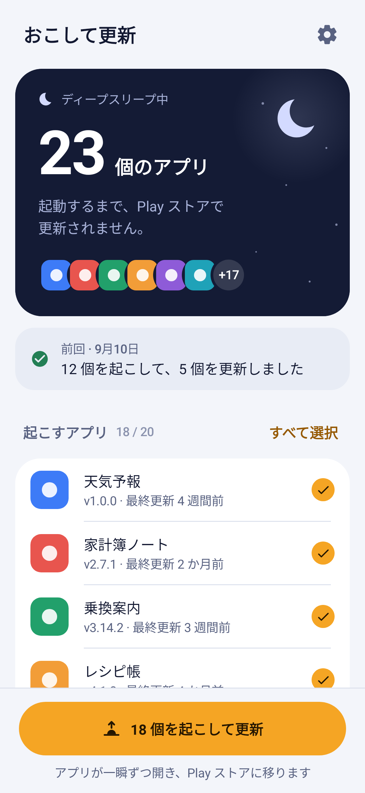
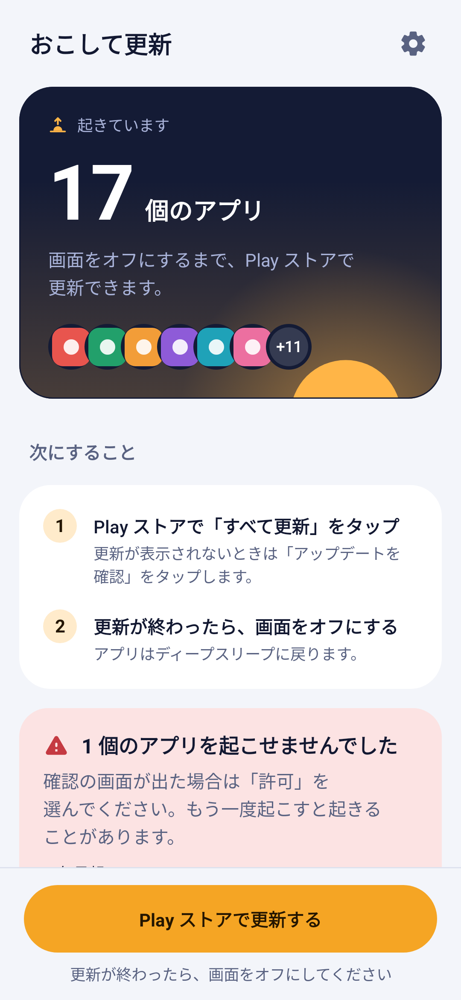
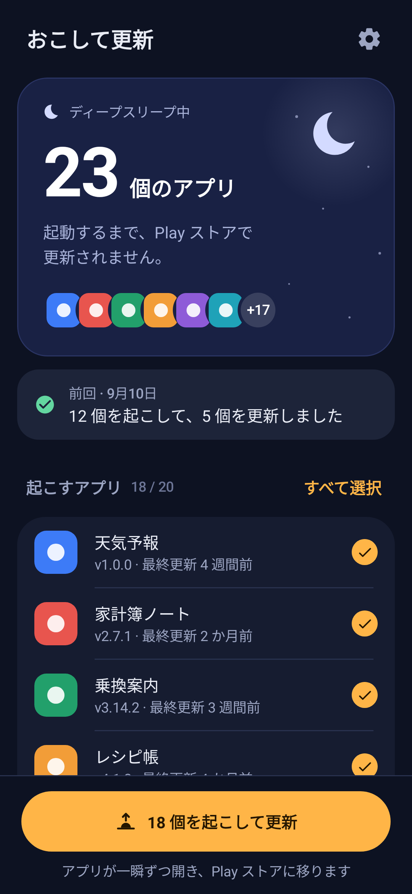

# おこして更新（Wake & Update）

Galaxy の「ディープスリープ中のアプリ」を一時的に起こして、Play ストアで更新できるようにするアプリです。
ディープスリープの設定はそのまま使えます。

| ディープスリープ中 | 起きている間 | ダークモード |
| --- | --- | --- |
|  |  |  |

## なぜ必要か

ディープスリープ中のアプリは、Samsung の仕様で「起動したときだけ動き、それ以外は通知も更新も受け取らない」状態になります。
Play ストアからも見えなくなるので、自動更新はもちろん、「アップデートを確認」をしても更新が表示されません。

ディープスリープは電池の持ちには効くので、設定は残したまま、ときどきまとめて起こして更新するためのアプリです。

## 使い方

1. 「N 個を起こして更新」をタップする
2. アプリが一瞬ずつ開いたあと、Play ストアの「アプリとデバイスの管理」が開くので、「すべて更新」をタップする
3. 更新が終わったら画面をオフにする。アプリはディープスリープに戻る

戻ってくると、更新されたアプリ（「3.14.2 → 3.15.0」のようにバージョン付き）が表示されます。

ほかにも次の方法で起こせます。

- **クイック設定のタイル**: 通知パネルの編集で「おこして更新」を追加すると、1 タップで起こせます
- **ショートカット**: アプリのアイコンを長押しして「起こして更新」
- **リマインダー**: 設定で「毎週」などを選ぶと、スリープ中のアプリがあるときに通知します（通知のボタンから起こせます）

起こしたくないアプリはチェックを外してください。選択は保存されます。
Galaxy Store などから入れたアプリは Play ストアで更新されないので、最初は選ばれていません。

## 仕組み

- Galaxy はディープスリープ中のアプリを無効化状態にします。ユーザーが入れたアプリのうち、無効化状態で、ランチャーから起動できるものをディープスリープ中とみなします
- アプリを起動すると Galaxy が一時的に起こし、画面をオフにするとまたディープスリープに戻します。これを利用して、選んだアプリを前面から順に起動し、最後に Play ストアの更新画面を開きます（バックグラウンドからはほかのアプリを起動できないため、自動では起こせません）
- 起こす直前のバージョンを記録し、あとで比べて「更新されたアプリ」を表示します
- 起こした数秒後に状態を確かめ、起きなかったアプリを「起こせなかったアプリ」として表示し、もう一度起こせるようにします
- 画面オフのあとも起きたままのアプリがあれば「スリープに戻っていません」と知らせます

同じ方法で動く [Update-Sleeping-Apps（旧 Runner）](https://github.com/moneytoo/Update-Sleeping-Apps) では、One UI 8.5（Android 16）での動作報告があります。

## 注意

- 起こすとき、アプリの画面が一瞬ずつ表示されます。起動時に音が鳴るアプリや、起動するだけで何かが始まるアプリは、チェックを外しておくと安心です
- One UI のバージョンによっては、「〇〇を開くことを許可しますか」のような確認が出ることがあります。「許可」を選んでください
- 起動したことで、アプリがディープスリープの一覧から外れる例が報告されています。このアプリは画面オフのあとに確認して知らせるので、その場合は「ディープスリープの一覧を開く」から追加し直してください
- リマインダーを確実に届けるには、設定の「このアプリをスリープさせない」から、このアプリを「自動的にスリープ状態にしないアプリ」に追加してください

## インストール（nox-apk-manager）

PC でリポジトリのルートから次を実行すると、release 版をビルドして Google Drive の `builds/wake-update/` に置きます。
中身は APK（`wake-update-<versionName>-release.apk`）、`meta.json`、一覧用の `icon.png` です。

```powershell
pwsh scripts\publish.ps1                  # release を置く
pwsh scripts\publish.ps1 -Variant both    # debug も置く
pwsh scripts\publish.ps1 -SkipBuild       # ビルド済みの APK をそのまま置く
```

端末の nox-apk-manager を開くと「おこして更新」が出るので、「導入」をタップします。2 回目以降は「全て更新」に含まれます。

- APK のコピーと `meta.json` の更新は nox-apk-manager の `scripts/publish-apk.ps1` に任せています。既定では modukit と同じ親フォルダの `nox-apk-manager` を使います。別の場所にあるときは `-ManagerDir` か環境変数 `NOX_APK_MANAGER` で指定してください
- 配布ルートは `publish-apk.ps1` と同じく環境変数 `NOX_BUILDS_ROOT` で変えられます（既定は `G:\マイドライブ\builds`）
- ほかの自作アプリと同じく、release も debug 鍵で署名します。manager で debug と release を切り替えても上書きできます
- nox-apk-manager は versionCode で更新を判定します。変更を配布するときは `build.gradle.kts` の `versionCode` と `versionName` を上げてください
- 一覧に出る名前は APK の既定のアプリ名です。そのため文字列の既定（`values/`）を日本語にしています
- 説明文は `distribution/description.txt`、アイコンは `distribution/icon.png` です
- 初めてビルドするときは Android SDK Platform 37 が必要です。SDK のライセンスに同意済みなら Gradle が自動で入れます

署名の鍵が違う APK には上書きできません。別の PC でビルドしたものなど、鍵の違う版が端末に入っている場合は、いったんアンインストールしてから入れてください。

## GitHub Actions から配布する（CD）

`main` に push すると、`.github/workflows/wake-update-cd.yml` がテスト → release ビルド → Google Drive の `builds/wake-update/` への配置まで行います。
置くのは PC の `publish.ps1` と同じ 3 つ（APK・`meta.json`・`icon.png`）なので、あとは端末の nox-apk-manager で「全て更新」を押すだけです。
中身は nox-apk-manager にある共通のワークフロー（[docs/CD.md](https://github.com/noxitro/nox-apk-manager/blob/main/docs/CD.md)）で、ほかのリポジトリからも同じように使えます。

- Drive にある版より versionCode が大きいときだけ置きます。配布するときは `build.gradle.kts` の `versionCode` と `versionName` を上げて push してください
- 同じ版を置き直したいときは、GitHub の Actions →「wake-update CD」→「Run workflow」で「同じ versionCode の版が Drive にあっても置き直す」にチェックします
- 過去の版の APK は消さずに残します（manager から古い版も入れ直せます）

### 最初に 1 回だけ: Secrets を登録する

PC で nox-apk-manager のフォルダから次を実行します。ブラウザが開くので、`builds/` のある Google アカウントで rclone を許可します。

```powershell
winget install GitHub.cli     # 初回だけ。そのあと gh auth login
winget install Rclone.Rclone  # 初回だけ
pwsh scripts\set-ci-secrets.ps1 -Repo modukit
```

リポジトリの Secrets に、debug 鍵（`DEBUG_KEYSTORE_BASE64`）と Drive に書き込むトークン（`RCLONE_DRIVE_TOKEN`）が入ります。
手で登録する方法、トークンの期限と扱いは nox-apk-manager の [docs/CD.md](https://github.com/noxitro/nox-apk-manager/blob/main/docs/CD.md) にあります。

任意で、Variables に `SIGNING_CERT_SHA256`（署名鍵の SHA-256。`keytool -list -v -keystore "$env:USERPROFILE\.android\debug.keystore" -storepass android` の SHA256）を登録すると、違う鍵で署名した APK を置く前に止まります。

## 開発

```sh
./gradlew :apps:wake-update:testDebugUnitTest          # テスト
./gradlew :apps:wake-update:recordRoborazziDebug       # screenshots/ と distribution/icon.png を作り直す
./gradlew :apps:wake-update:lintDebug
```

- `domain/`: 起こす対象の選び方（`Selection`）と、起こしたあとの判定（`SessionEvaluator`）。Android に依存しない
- `wake/`: アプリを起こす処理（`WakeActivity`, `WakeLauncher`）とクイック設定のタイル
- `ui/`: Jetpack Compose の画面。`screenshots/` は `ScreenshotTest` で描いた画像

### デザイン

- **色**: 夜（ディープスリープ）から夜明け（起きている）へ。夜の藍 `#141B35`、霧の白 `#F3F5FA`、夜明けの琥珀 `#F5A524`、月明かり `#D3DAFF`。状態の色は、更新済みの緑 `#237F55` と要確認のコーラル `#C53A42` を使い分ける
- **文字**: One UI の端末フォント。64 / 20 / 17 / 15 / 13 / 11sp の段階だけを使い、日本語は文節の途中で改行しない
- **配置**: One UI と同じく、上半分を見る領域（夜空のパネルと大きな件数）、下を操作する領域（一覧と、親指の届く位置の固定ボタン）にする。アプリが起きている間は、パネルの地平線から太陽が昇る
